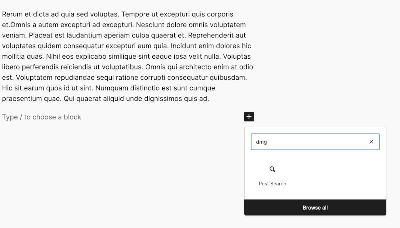
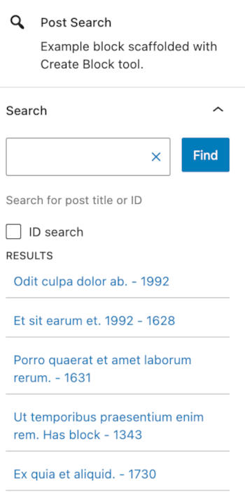
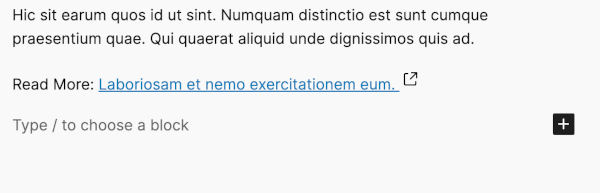

# DMG Block & WP-CLI Command posts search

## What to expect from this plugin:
- A Gutenberg block that inserts the title and permalink of the selected post into a placeholder element
- Ability to submit post ID or search term to narrow search results
- A custom WP-CLI command to list all posts (by their ID) that contain the block
- Search between before and afters dates using cli flags

## Installation
 The command `npx @wordpress/create-block@latest my-block-name` was used to scaffold the block plugin.

### Requirements

- PHP 7.4 or higher

### How to install

In the root of the plugin folder type,
`npm install`

### Development
`npm run start` - for local development

`npm run build` - for production

## Useage

### The Block
Click the block inserter inside the editor and search for 'dmg'. This will list the blocks available under the `dmg-blocks` category. Select the 'Post Search' block to insert.

Using the block settings, search and find the post whose title and permalink you wish to use. Either use a search term or a post ID to find the post. For the latter ensure that the "ID seach" checkbox is selected 

By clicking a post within the list of results the "Read more:" placeholder in the editor will be populated by that post's title and permalink.

### The WP-CLI command

Command: `dmg-find-posts`
Optional flags: `date-before` & `date-after`
Date format must be: `dd/mm/yyyy`

The flags can can be used together, separately or not at all. So the following are valid commands:

`wp dmg-find-posts`

`wp dmg-find-posts --before-date=02/11/2023 --after-date=27/01/2010`

`wp dmg-find-posts --after-date=27/01/2010`